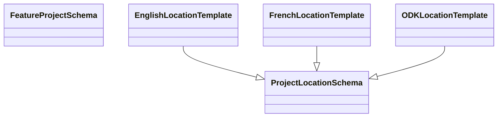

# Introduction to the model architecture

In this section, we will describe how the model is structured, created and how it works. Most importantly, we will discussion the connection of the different templates that the user might see and how we validate the consistency with the model.

## The need of a machine readable schema

Using Excel files to define the complex data structures of the project location model is impractical in the long term. Excel lacks the ability to enforce strict data types, validation rules, and hierarchical relationships inherent in complex data models. Unlike machine-readable formats like JSON Schema, Excel does not provide a standardized, programmatically verifiable way to represent nested structures or constraints. Machine-readable formats like JSON Schema, on the other hand, allows for clear, consistent definitions with built-in validation, making it more suitable for defining and validating complex data structures.

JSON Schema can aid additional problems on versioning and translations in the following ways:

1. **Versioning**: JSON Schema allows you to define and document different versions of your data structures clearly. Each schema can include version identifiers, enabling developers to manage and track changes over time. This ensures backward compatibility, where older versions can be maintained alongside newer ones, and provides a clear upgrade path for evolving data models.

2. **Translations**: JSON Schema supports localization by allowing you to define metadata such as descriptions, error messages, and labels in multiple languages. This makes it easier to translate the schema's user-facing components into different languages without altering the underlying structure. Tools can then use this metadata to provide language-specific outputs or error messages, facilitating a seamless multilingual experience.

## The json schema

We are a number of JSON schemas to define the project location model. You might find the JSON schemas in the `references` folder under `feature_project_schema.json`. They serve as the reference on the allowed fields of the project location model. They defines the structure, data types, and constraints for each field, ensuring consistency and correctness across different implementations. They are then used in the following ways:

### **Automated tests** 
We have started to write tests that verify that different data files are conform with the schema. This includes examples files for xlsx, json and csv in python.
The tests will executed by the github-pipeline [validation_tests.yml](https://github.com/openkfw/open-geodata-model/blob/main/.github/workflows/validation_tests.yml)
The tests are in the [test-folder](https://github.com/openkfw/open-geodata-model/tree/main/tests)
Run the tests by executing the following steps from the root directory of this project:
```bash
pipx install poetry
poetry install
poetry run pylint tests
poetry run black --check tests
```
### **Documentation** 
We use [json-schema-for-humans](https://pypi.org/project/json-schema-for-humans/) to automatically generate the documentation of the model. This documentation can be found [here](feature_project_schema.md).
The documentation will be created automatically by the [build_website.yml](https://github.com/openkfw/open-geodata-model/blob/main/.github/workflows/build_website.yml).
Building the documentation locally run the following steps from the root directory of this project:
```bash
generate-schema-doc --config template_name=md references/dac5_schema.json docs/dev/
generate-schema-doc --config template_name=md references/sector_location_schema.json docs/dev/
generate-schema-doc --config template_name=md references/feature_project_schema.json docs/dev/
generate-schema-doc --config template_name=md references/project_core_schema.json docs/dev/
generate-schema-doc --config template_name=md references/generated_sector_location_schema.json docs/dev/
```
The local documentation will be written under the [docs/dev-folder](https://github.com/openkfw/open-geodata-model/tree/main/docs/dev)

In the future, it can serve as the basis of:

- **Data validation**: The schema can be used to validate data files, ensuring that they conform to the expected structure and constraints. This helps catch errors early and maintain data quality.
- **Conversion tools**: The schema can be used to generate conversion tools that transform data between different formats while preserving the integrity of the underlying data model. This can facilitate interoperability between systems that use different data representations.

### On the relationship between templates and the schema

The schema are references for the project location model. They serve as the foundation for the templates, which are specific instantiations of the model tailored to different use cases. The templates are derived from the schema and provide a user-friendly interface for interacting with the model. They define the fields, labels, and constraints that users see and interact with, while the schema enforces the underlying data model. The filled templates get transformed into the json-format with a unique transformation-script, to then be validated against our schema. Different examples are:

- **The english excel template**: This template is a specific instantiation of the project location model tailored for English-speaking users. It includes the fields, labels, and constraints defined in the schema, presented in an Excel format for easy data entry and manipulation.
- **The french excel template**: This template is another instantiation of the project location model tailored for French-speaking users. It follows the same structure and constraints as the English template but provides translations and labels in French.
- **The ODK form**: This template is a mobile-friendly instantiation of the project location model designed for data collection in the field. It includes the same fields and constraints as the Excel templates but is optimized for use on mobile devices.

Let us therefore visualize the relationship between the schema and the templates:



## Location types

To classify the project locations in a consistent manner the project location model uses [location types](location_type.md). This allows use to describes the project locations types with attributes such as the project name, translations categories etc. Take for the location type of a *university* for example. Selecting such a location type we are directly able to provide the french translation (université), the sector (education), the geometry (point), a unique identifier (UNIV) and other attributes. This substantially simplifies the data analysis afterwards.

For a more detailled explanation of the location types, please refer to the [location type documentation](location_type.md).