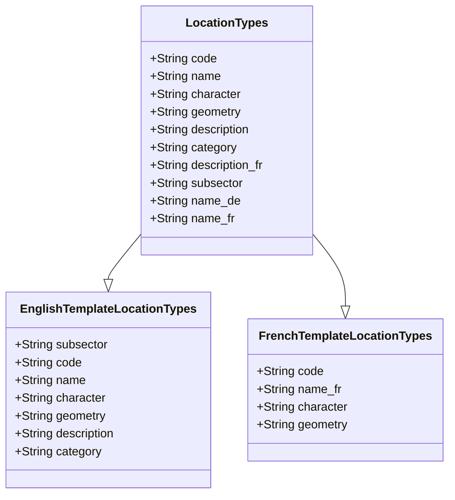

# Notes on location types

In this section, we will detail our approach to the location types that are available in the *open project location model*. The current reference of location types can be found [here](https://github.com/openkfw/open-geodata-model/blob/main/references/kfw_location_type.xlsx). So this section is most relevant to developers and maintainers of the open project location model. If you would like to know how to select the right location type in the excel template, please see directly [here](../technical_notes.md#what-is-a-location-type).

## What is a Location Type?

This template closely follows the International Aid Transparency Initiative (IATI) standard, but we have created additional location types to cover all Financial Cooperation project types. This enables the aggregation of information among multiple location types. Our new location type list includes the IATI location types that are useful for International Development, as well as additional location types for all sectors that were missing in the existing IATI list. We have created 197 new project location types, including "immaterial" ones like Capacity Development/Training or Voucher Schemes, that cannot be plotted according to any physical feature on a map but can be defined by the area covered by them.

### IATI Location Types

We have based our work on the the IATI reference for [location types](https://iatistandard.org/en/iati-standard/203/codelists/locationtype/). Within this standard each location has four attributes:

- `code`: The unique identifier for the location type.
- `name`: The name of the location type.
- `description`: A description of the location type.
- `category`: The category of the location type. It is equivalent to the US NGAs `feature class`.

This reference is so useful that we decided to use it as the baseline for the location types that are available within the open project location model.

### KfW Location Types

We have extended the IATI location types to better meet the needs of FC projects. We will specify it in detail below but the main requirements were:

- *Better match for FC locations.* Therefore we added numerous location types that are not available in the IATI standard and remove location types that are not relevant for FC projects.
- *Simple translation.* We have started to provide the template itself in several languages and we want to make sure that the location types are easy to translate and to keep consistent.
- *More details.* We found that it is important to describe the location types in more detail to make sure that the users understand the differences between them. Therefore we added new attributes to the location types.

### Location Type Attributes

In this section we summarize the availble attributes for the KfW location types.

| **Name** |  **Mandatory**  | **Description** | **Part of IATI** |
| --:| ---------:| ----------------:|----:|
| code | Yes | The unique identifier for the location type. | Yes |
| name | Yes | The name of the location type in english language. | Yes |
| character | Yes | Describes if the location type describes a physical location, then it is to be set to `physical`, or an activity, then it is to be set to `immaterial`. | No |
| geometry | Yes | Describes the allowed geometry of the location type. Can be only one of the three types `point`, `line` or `polygon`.  | No |
| description | No | A description of the location type in english language. | Yes |
| category | No | The category of the location type. It is equivalent to the US NGAs `feature class`. | Yes |
| description_fr | No | The description of the location type in french language. | No |
| subsector | No | The name of the subsector with which the location type is associated. Should be formulated in english.| No |
| name_de | No | The name of the location type in german language. | No |
| name_fr | No | The name of the location type in french language. | No |

### On the link of location types and the templates

We can use the location type reference to ensure consistency between different implementations of the *open project location model* and different translations. Currently, there are two implementations of the location model, namely the french and the english translation. In both cases the location types can be found in the worksheet `Location Types IATI and New`. With the reference, we can now ensure that both templates implement all the location types by checking that all the codes are within the code list of the template. 

This can be automatically tested via the `test_location_types.py` script, which is contained in the tests `folder`.

### Possible outlooks

The following section, is meant as summary for possible new steps in the development of the location types. So it is really an invitation to discuss and to provide feedback but certain to evolve in the future.

- We have currently not solved the issue of consistent translations for certain attributes as as `subsector`, `character` and `geometry`. They have only a limited number of choices. So my preferred option would be to create references with the translations for these attributes.
- Schemas. It would be nice to have the definitions from above in a schema that can be used to validate the location types.
