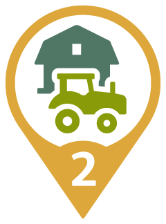
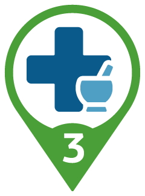
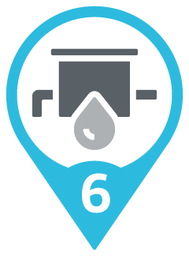
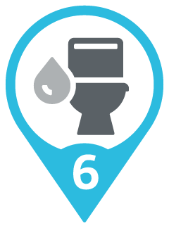
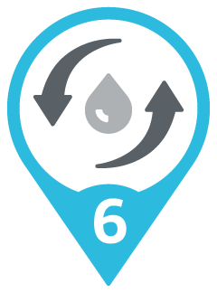
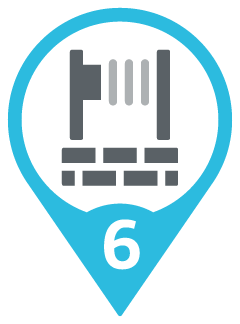

# IATI-based SDG-colored Location Type Icons

## Zero hunger

<figure markdown>
  
  <figcaption> <b>AGRF</b> - agricultural facility</figcaption>
</figure>
<figure markdown>
  
  <figcaption> <b>CNLI</b> - irrigation canal</figcaption>
</figure>
<figure markdown>
  
  <figcaption> <b>CULT</b> - cultivated area</figcaption>
</figure>
<figure markdown>
  
  <figcaption> <b>FRM</b> - farm</figcaption>
</figure>
<figure markdown>
  
  <figcaption> <b>OCH</b> - orchard</figcaption>
</figure>

## Good health and Well-Being
<figure markdown>
  
  <figcaption> <b>HSP</b> - hospital</figcaption>
</figure>
<figure markdown>
  
  <figcaption><b>HSPC</b> - clinic</figcaption>
</figure>
<figure markdown>
  
  <figcaption> <b>HSPD</b> - dispensary</figcaption>
</figure>

## Quality Education
<figure markdown>
  
  <figcaption> <b>SCH</b> - school</figcaption>
</figure>
<figure markdown>
  
  <figcaption> <b>SCHA</b> - agricultural school</figcaption>
</figure>
<figure markdown>
  
  <figcaption> <b>SCHC</b> - college</figcaption>
</figure>
<figure markdown>
  
  <figcaption> <b>SCHT</b> - technical school</figcaption>
</figure>

## Clean Water and Sanitation 
<figure markdown>
  
  <figcaption> <b>CNLA</b> - aqueduct</figcaption>
</figure>
<figure markdown>
  
  <figcaption> <b>PMPW</b> - water pumping station</figcaption>
</figure>
<figure markdown>
  
  <figcaption> <b>RSVT</b> - water tank</figcaption>
</figure>
<figure markdown>
  
  <figcaption> <b>SAN</b> - sanitary facilities</figcaption>
</figure>
<figure markdown>
  
  <figcaption> <b>SWT</b> - sewage treatment plant</figcaption>
</figure>
<figure markdown>
  
  <figcaption> <b>WLL</b> - well</figcaption>
</figure>
<figure markdown>
  
  <figcaption> <b>WTRW</b> - waterworks</figcaption>
</figure>

## Affordable and Clean Energy
<figure markdown>
  
  <figcaption> <b>CVS</b> - converter station</figcaption>
</figure>
<figure markdown>
  
  <figcaption> <b>EPTD</b> - electric power transmission and distribution</figcaption>
</figure>
<figure markdown>
  
  <figcaption> <b>PS</b> - power station</figcaption>
</figure>
<figure markdown>
  
  <figcaption> <b>PSH</b> - hydroelectric power station</figcaption>
</figure>
<figure markdown>
  
  <figcaption> <b>PVGD</b> - photovoltaik grid</figcaption>
</figure>
<figure markdown>
  
  <figcaption> <b>PVPS</b> - photovoltaik power station</figcaption>
</figure>

## Decent Work and Economic Growth
<figure markdown>
  
  <figcaption> <b>CTRB</b> - business centere</figcaption>
</figure>
<figure markdown>
  
  <figcaption> <b>DEVH</b> - housing development</figcaption>
</figure>
<figure markdown>
  
  <figcaption> <b>INDS</b> - industrial area</figcaption>
</figure>
<figure markdown>
  
  <figcaption> <b>MFG</b> - factory</figcaption>
</figure>

## Industry, Innovation and Infrastructure
<figure markdown>
  
  <figcaption> <b>BDG</b> - bridge</figcaption>
</figure>
<figure markdown>
  
  <figcaption> <b>BLDG</b> - building</figcaption>
</figure>
<figure markdown>
  
  <figcaption> <b>CHN</b> - channel</figcaption>
</figure>
<figure markdown>
  
  <figcaption> <b>DAM</b> - dam</figcaption>
</figure>
<figure markdown>
  
  <figcaption> <b>DRCNL</b> - city street with drainage canal</figcaption>
</figure>
<figure markdown>
  
  <figcaption> <b>FPWL</b> - flood protection wall</figcaption>
</figure>
<figure markdown>
  
  <figcaption> <b>HSE</b> - house</figcaption>
</figure>
<figure markdown>
  
  <figcaption> <b>RD</b> - road</figcaption>
</figure>
<figure markdown>
  
  <figcaption> <b>ST</b> - street</figcaption>
</figure>

## Climate Action
<figure markdown>
  
  <figcaption> <b>FRST</b> - forest</figcaption>
</figure>
<figure markdown>
  
  <figcaption> <b>PRK</b> - road</figcaption>
</figure>
<figure markdown>
  
  <figcaption> <b>WTRC</b> - watercourse</figcaption>
</figure>

## Peace, Justice and strong Institutions
<figure markdown>
  
  <figcaption> <b>ADMF</b> - administrative facility</figcaption>
</figure>
<figure markdown>
  
  <figcaption> <b>BLDO</b> - office building</figcaption>
</figure>
<figure markdown>
  
  <figcaption> <b>CMN</b> - common</figcaption>
</figure>
<figure markdown>
  
  <figcaption> <b>CTRCM</b> - community center</figcaption>
</figure>
<figure markdown>
  
  <figcaption> <b>GDN</b> - garden</figcaption>
</figure>
<figure markdown>
  
  <figcaption> <b>GOVL</b> - local government office</figcaption>
</figure>
<figure markdown>
  
  <figcaption> <b>MKT</b> - market</figcaption>
</figure>
<figure markdown>
  
  <figcaption> <b>PP</b> - police post</figcaption>
</figure>
<figure markdown>
  
  <figcaption> <b>PPL</b> - populated place</figcaption>
</figure>
<figure markdown>
  
  <figcaption> <b>ZN</b> - zone</figcaption>
</figure>
