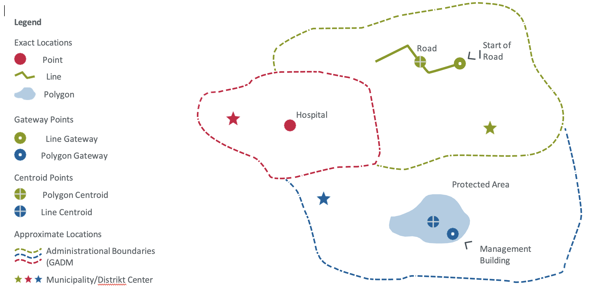

---
# Technical Notes on the Project Location Model

**Please Note**
You can find the current version of the projection location template [here](https://raw.githubusercontent.com/openkfw/open-geodata-model/main/Project_Location_Data_Template_V02.xlsx).

## Mandatory and Non-Mandatory Fields
When collecting data, there are certain mandatory fields that must be completed, as well as non-mandatory fields that can be used to gather additional site-specific information. It is important to check if there are any [*Terms of Reference (ToRs)*](../docs/overview_templates_tor.md) for this project location data collection that specify additional required fields. If there are no ToRs available, please consult with your KfW counterpart to determine which non-mandatory fields should be filled out.

## What is a project location?
**A project location may comprise one or more features that are part of a financially supported activity where it is not feasible to make any further geographical distinctions regarding funding.** For instance, a financially supported hospital in a specific location is an example of a single-feature project location. Another example of a project location with multiple features is a group of adjacent agricultural plots that are being financed under an irrigation plan that benefits all producers in that area. Additionally, a set of protected areas that are jointly financed from a fund is another example, provided that it is not possible to make any further geographical distinctions regarding the allocation of funds to specific areas. However, if discrimination is possible, data for multiple project locations (such as protected areas) and their financial allocation must be collected. KfW strongly encourages increasing the geographical discrimination of financial flows to specific project locations to the maximum extent possible, as this enhances aid transparency and financial accountability.

## Exact locations and how to collect them
A project location can be either exact or approximate[^1]. The exact location refers to the geographical endpoint of an international development assistance financial flow. If you already know the exact location coordinates, you may indicate them as "exact" locations. The Excel Template enables you to collect single location points, such as a power plant site, or a larger number of project sites and features, such as 300 locations of buildings in different sectors within the framework of a decentralization project using Latitude and Longitude Coordinates. Additionally, project sites with larger areas and more complex geometries, such as polygons of forest protection areas, or linear location types like roads or railways, are also supported but must be submitted in an extra file in KML format.

'Exact[^1] locations' can have three different geometry types:

1.  **Point** geometries (e.g., a well or a hospital)

2.  **Line** geometries (e.g., a road or transmission line)

3.  **Polygon** geometries (e.g., a protected area or agricultural plots)

Regardless of the geometry type, all project locations should initially be collected as a point location in the Excel Template. This point can represent the location itself or a gateway to the project site, regardless of the actual feature geometry (i.e., also for lines and polygons). The gateway point could be, for example, the beginning of a road, a village adjacent to agricultural plots, or the administration building of a protected area. If there is a line or polygon geometry and no gateway/entry point can be defined, the geometrical center (centroid) may also be used.
[^1]: in the sense of the IATI- Standard

**All coordinates in Excel must be collected using WGS 84 (EPSG 4326) as the coordinate reference system[^3]**. WGS 84 is the standard for web mapping applications. Geo-coordinates have to be provided in the decimal place format 00.00000 in the "Latitude" and "Longitude" columns (using at least 5 digits after the separator).
[^3]: World Geodetic System 1984 (https://support.virtual-surveyor.com/en/support/solutions/articles/1000261351-what-is-wgs84\)

**If you have line or polygon geometries**, you must use both the Excel template to store all relevant metadata for each location and an additional KML file to store the associated geometries for each location. The Excel file contains two columns that will enable us to link the geometries with the metadata in Excel. These columns are called "Filename of additional Geo-data submitted as KML" and "Primary Key (As provided in the KML file)". The first column should contain the filename of the KML file that you send to KfW, for example "00345_Ouagadougou.kml". The second column should contain a "primary key" that must also be present in the attribute table of your KML file and links the geometry to the metadata in Excel. You must name the column "primary key" in KML as well. Use whole numbers (integers) to construct the primary key. In Excel, you may also provide a "gateway point" (for details, see the section "Geometrical characteristics of exact locations"). This point can help us verify whether the link between the information in KML and Excel is correct. You must submit all locations for your project in a single KML file.
We highly encourage you to check the data before submission in GIS software, such as QGIS or Google Earth Pro. This will reduce the need to go back and forth between the responsible KfW counterparts and the project staff.
[^2]: KML (KMZ) is an open XML Standard for Points, Lines and Shapes. Officially named the OpenGIS KML Encoding Standard (OGC KML). It is maintained by the Open Geospatial Consortium, Inc. (OGC). Other Geoformats (e.g., Shapefiles or Geojson) can usually be converted to KML in Standard Geographic Information System (GIS) Software such as ArcGIS or QGIS.

## Approximate locations

The approximate location option [^1] should be selected if one or more of the following circumstances apply:
1. **An exact project location has not (yet) been specified or is not yet known** (e.g., the exact project locations have not yet been determined) -> then choose the option: *approximate (yet unknown)*.

2. **An exact project location is not to be collected or communicated due to security reasons** (e.g., in a conflict zone) -> then choose the option: *approximate (security)*.

3. **The target location(s) is/are one or more administrative units**, such as a district, a province, or the entire country or group of countries (e.g., an entire country for a Policy-Based-Lending project or a number of districts in a country for a decentralization project) -> then choose the option: *approximate (admin unit)*.
   
In the case of security risks (e.g., conflict zones), we strongly recommend only publishing approximate locations! Approximate locations can be given using either point or polygon data. You may use administrative areas from existing databases, for example.
## Figures
<figure markdown>
  
  <figcaption>Figure 1: Schematic Representation of Different Location Data for the GeoApp</figcaption>
</figure>

## What is a Location Type?
 
This template closely follows the International Aid Transparency Initiative (IATI) standard, but we have created additional location types to cover all Financial Cooperation project types. This enables the aggregation of information among multiple location types. If you cannot find a specific location type, please use the most similar location type, such as "well" for an "extraction well". You can then add additional information on the location type, such as "extraction well", under "additional location types", if necessary.

Our new location type list includes the IATI location types that are useful for International Development, as well as additional location types for all sectors that were missing in the existing IATI list. We have created 197 new project location types, including "immaterial" ones like Capacity Development/Training or Voucher Schemes, that cannot be plotted according to any physical feature on a map but can be defined by the area covered by them. Therefore, we have also adapted the definition of "location type" as "project output- or intervention-related type of physical location or immaterial output- or intervention area". Please refer to the list of Location Types in the Excel Template for more information. Definitions for the original IATI-based location types can be found [here](https://iatistandard.org/en/iati-standard/203/codelists/locationtype/). A comprehensive list of all location types can be found in the Excel Template.
After preselecting the KC Theme/Sub-Sector, please choose the most appropriate location type from the table sheet "Location Types". If there is no suitable option, please select "other physical" or "other immaterial" and fill out the next column "Alternative Location Type". If you need or want to mention two different location types (e.g., school and capacity development) at the same GPS coordinate, you may create two separate rows for these location types with different activity descriptions and DAC/CRS codes at the same GPS coordinates.
**Please note that the preselection column "KC Theme/Sub-Sector" is only intended to help you quickly find the correct location type name.** It will not be saved in the system and does not replace the DAC5 Purpose Classification/CRS-Code assignment below, which effectively assigns the correct subsector to each location.

## DAC 5 Purpose Classification/CRS-Code
The one to four five-digit DAC 5 Purpose Codes for the entire project must be provided by your KfW counterpart (ideally in the project location data collection ToR, see samples [here](../docs/overview_templates_tor.md)). If there is more than one code for the project, you must assign the correct code to each location. For example, in a decentralization project, the construction of primary school locations should be assigned to the respective Basic Education DAC 5-Code, while road rehabilitation sites within the same project should be assigned to the respective Transport DAC 5-Code.

If your project contains locations that contribute not only to one but two, three, or four DAC/CRS-Codes, please create two, three, or four separate rows with the same GPS coordinates but different DAC/CRS-Codes, and potentially different location types and activity descriptions.
If all codes must be assigned to all locations, please create a new row for each location, with the only difference being the DAC 5 Purpose Classification. For the complete list of codes, please refer to the table sheet "DAC Purpose Codes" of the Excel Template.

## Privacy, confidentiality, and publication
The Excel Template must be submitted without containing any personal data or any data that could be linked to individual persons, such as houses of private households. Please note that KfW does not publish any exact coordinates of its project locations. Location data collection in fragile and conflict contexts should be treated with extra diligence.

----------------------------------------------------------------------------------------------------------------------

## The Project Location Model

Table 1: The Project Location Model for Development Cooperation

| **Column** | **Name** | **Type of data** |  **Mandatory**  | **Description** | 
| --:| ---------:| ----------------:| ---------------:| --------------:|
| A.| Unique ID | Number | Filled out by KfW | For new locations, this column will be empty. For updates, your KfW counterpart will provide you with a list of unique_id numbers in this file to ensure that updated location IDs match with the former ones. |
| B.| KfW project No. (INPRO) | Number | Yes | Every project location in the FC Geodata Model must be assigned to its respective KfW project number, which is provided by KfW in the [project location data collection ToR](../docs/overview_templates_tor.md). |
| C.| Abbreviation of project name (project acronym) | Text | No | Please enter the acronym used for the name/title of the project (e.g., HREII) to be visible on your map. If the project has multiple phases, please add the number of the phase belonging to the aforementioned KfW Project-No. |
| D.| Data Owner (Institution Name) | Text | Yes | Legal entity that owns the data provided here (= legal authorship). |
| E.| Publishing restrictions due to security reasons | Select Text (yes/no) | Yes | Indicates if this information is collected in fragile regions (e.g., areas of severe civil conflict or war) and should therefore be omitted from publicly available reports. |
| F.| Date of data collection or latest update   | Date YYYY-MM-DD (Date format - English/US)  |No| Date of data collection or latest update (if date of data collection is unknown). In case only the year is available please choose the 1st of january e.g. 2022-01-01 |
| G.| Project-specific location identifier  | Text     |No| If the location or activity has a project-specific identifier (e.g., a location code in the MIS of the source agency, e.g., Project Executing Agency (PEA)) or an identifier in a public database like GADM, it can be entered here.|
| H.| Location name |Text  |Yes| Short name of the project site ideally containing a summary of the main project activity and the location name (max. 40 characters or digits) |
| I.| Location activity status  | Select Text    | No | The location activity status according to the IATI standard. If you are unaware of the current status please choose "NA". |
| J.| Planned or actual start date of activity at the location   | Date  YYYY-MM-DD (Date format - English/US)  | Yes | Approximate planned or actual start date of implementation of activities on the ground. This can be, for example, the date when construction work is planned to begin. If there is no information available, please enter 2100-01-01. Ideally, the start of project implementation is defined in the  [project location data collection ToR](../docs/overview_templates_tor.md). |
| K.| Planned or actual end date of activity at the location   | Date  YYYY-MM-DD (Date format - English/US)  | Yes | Approximate planned or actual end date of activities on the ground. This can be, for example, the date when the project is planned to cease implementation activities. If there is no information available, please enter 2100-01-01.|
| L.| Activity-Description (general)  | Text | Yes | A short description of the main project activity in this location, e.g., hydropower plant construction or construction of small irrigation systems. |
| M.| Additional activity description  | Text | No | Free text (in case you need to add other location–specific information like production volumes, progress values or a tag like “COVID-19”). Please consult your KfW counterpart if additional information is required. |
| N.| KC Theme / Sub-Sector | Select Text | Yes | Sectoral / cross-sectoral location type preselection field, see table sheets "Location Types" & KC Themes. If there is no fit,  select "other physical or other immaterial and fill out the column "Alternative Location Type". |
| O.| Location Type Name | Select Text     | Yes | After selecting the KC Theme/Sub-Sector, please choose the most appropriate location type from the table sheet "Location Types". If there is no suitable option, please select "other physical" or "other immaterial" and fill out the next column "Alternative Location Type”.|
| P.| Alternative Location Type Name  | Text    | No | If you selected "other physical" or "other immaterial" in the column "Location Type Name", please propose your own location type name. This promotes systemic learning, allows us to identify additionally required location types, and will help us propose a comprehensive IATI standard extension in the future.|
| Q.| DAC 5 Purpose Classification /CRS-Code   |Text  | Yes | The DAC 5 Purpose Codes (one to four) for the entire project have to be provided in the [project location data collection ToR](../docs/overview_templates_tor.md) or by your KfW counterpart, see notes above. |
| R.| Budget share | Currency number in EUR    | No | The budget share allocated to this location in €. The sum of all locations in a project should add up to the budget sum in Inpro/PMT, including overheads. Please do not enter data from private entities/PEAs here!|
| S.| Geographic exactness | Select Text | Yes | Please use "exact" if you know the geographically exact end destination of a financial flow and it is not an administrative unit, and if you do not face security restrictions to do so. If not, please use the respective type "approximate".|
| T.| Latitude | Decimal Number    | Yes | Enter the Latitude measured with a GPS device (or centroid for approximate locations). Make sure to use WGS 84 as the Coordinate Reference System (EPSG:4326). Enter Values with at least FIVE digits. Example: 50.12018514689011. |
| U.| Longitude | Decimal Number    | Yes | Enter the Longitude measured with a GPS device (or centroid for approximate locations) here. Make sure to use WGS 84 as the Coordinate Reference System (EPSG:4326). Enter Values with at least FIVE digits. Example: 8.655474047059236  |
| V.| Related Community / Village / Neighborhood | Decimal Number    | No | You may enter a village, hamlet, or neighborhood name that relates to this location. This can serve to manually add smaller community or administrative unit names not identified in existing global databases.|
| W.| Filename of additional Geo-data submitted as KML (Lines/Polygons) | Text    | Yes, if kmldata is provided | Filename of the KML file where the associated geometry information is found. Note that to link an entry from this Excel to the KML file, it is required to correctly fill in the Primary Key column. |
| X.| Primary Key (as provided in KML file) | Decimal Number    | Yes, if kmldata is provided | This is only required if you provide additional geolocation information in another KML file. The geometry in the KML file should have the same primary key as listed here|

----------------------------------------------------------------------------------------------------------------------

## Additional notes on selected fields from the model
### A unique ID for each project location
Every project location in the Project Location Model must receive a unique location identifier number by KfW. For new locations, this column will be empty. For updates, your KfW counterpart will provide you with a list of unique_id numbers in this file to ensure that updated location IDs match with the former ones. Please use the IDs provided to you by your KfW focal point from then onwards. Please do not change this field. 

### Publishing restrictions due to security reasons
Indicates if this information is collected in fragile regions (e.g., areas of severe civil conflict or war) and should therefore be omitted from publicly available reports. In fragile contexts, geolocation information must be protected and is not to be published.

### Project-specific location identifier	
If the location or activity has a project-specific identifier, such as a location code in the MIS of the PEA, this can be entered here. This enables logically connecting and comparing the location/activity in the KfW system against the location/activity in the PEA system. 

### Budget Share
The budget share allocated to this location in €. The sum of all locations in a project should add up to the official budget sum, including overheads. Data from private partners/PEA must not be entered here! If the budget shares of all locations are to be provided, the budget sum will be provided by the KfW counterpart in the [project location data collection ToR](../docs/overview_templates_tor.md).
